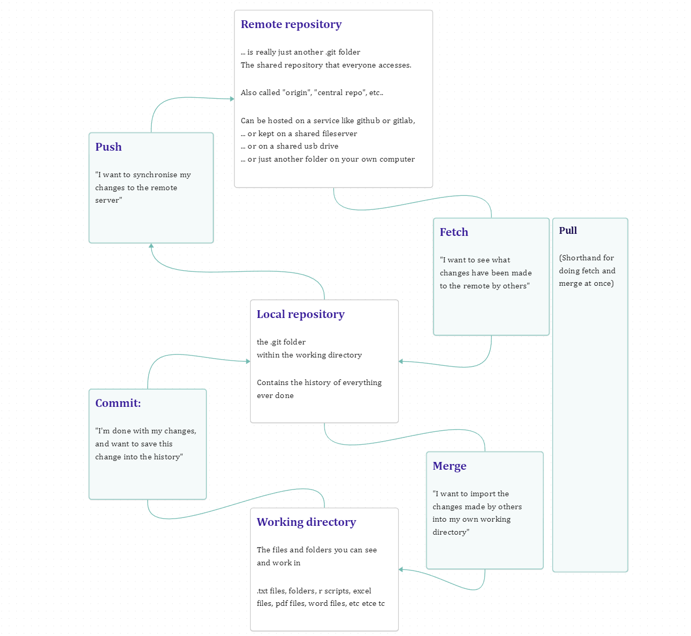
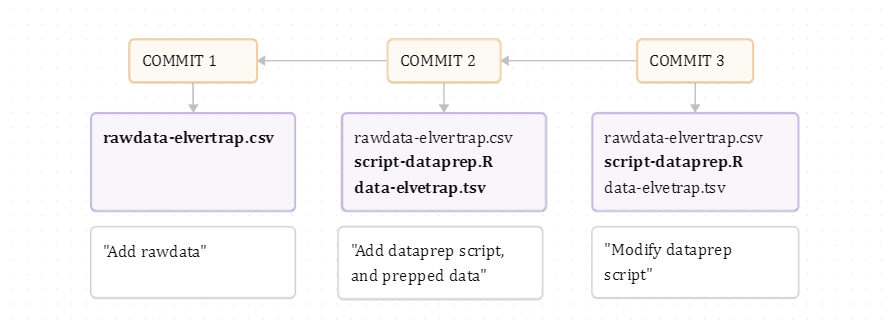
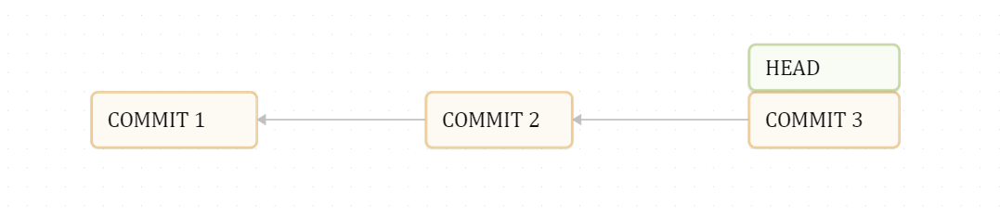
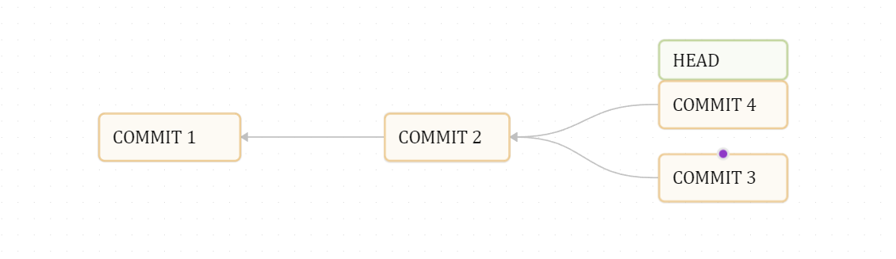
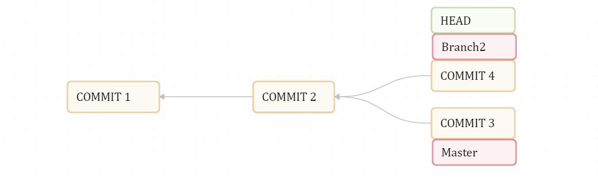
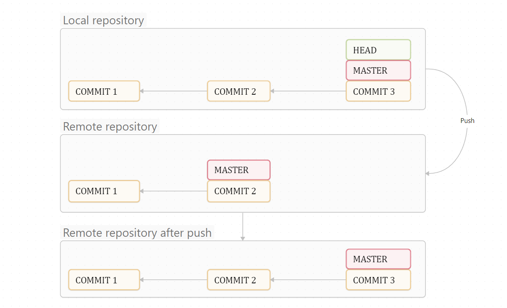
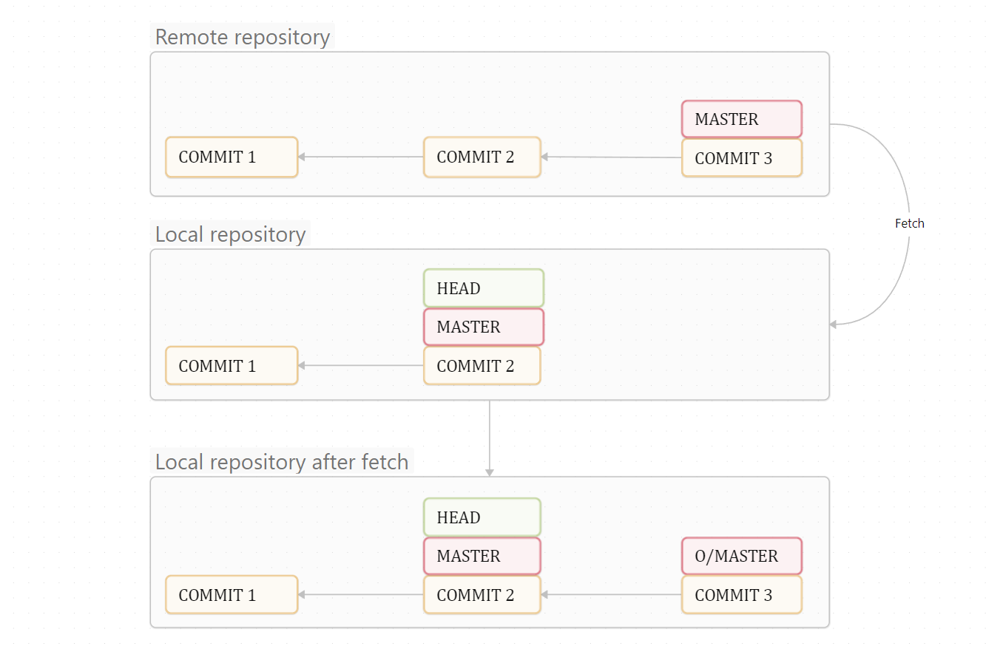
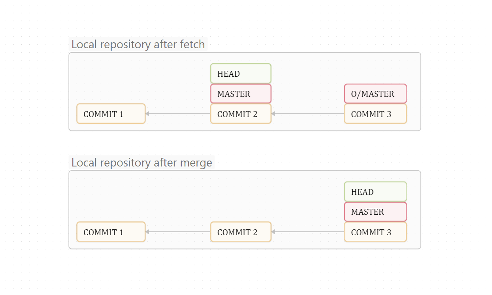
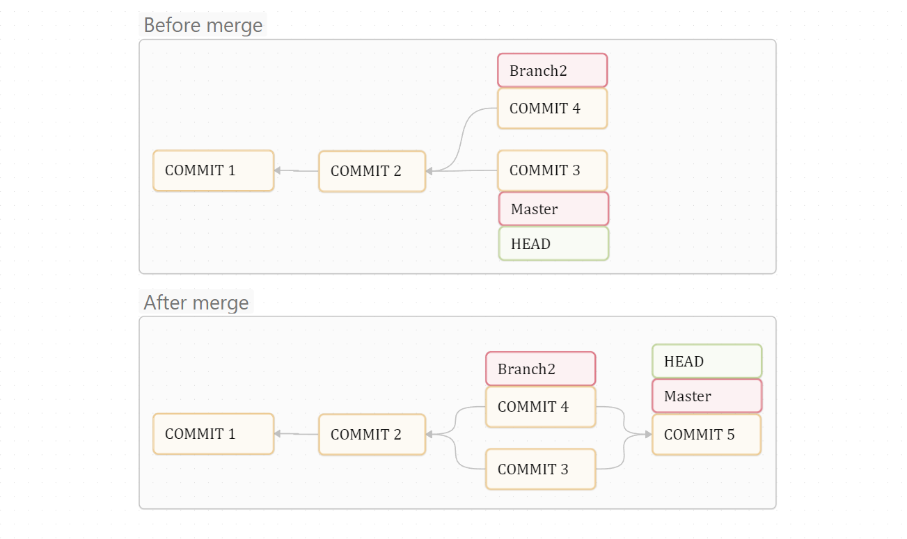

# Git introduction

A brief guide to git at a conceptual level. For a more detailed introduction, see the [Pro Git book](https://git-scm.com/book/en/v2)

This intro is designed to give you the ***conceptual overview*** as briefly as possible. Feel free to edit if you can 1) Correct mistakes, 2) Reduce redundant text, or 3) Add in glaringly obvious omissions.

## Brief introduction

[Git](https://git-scm.com/) ([wiki](https://en.wikipedia.org/wiki/Git)) is a system for version control and collaboration on work with computer files. It lets you create a specialized history of file edits, which you can either use alone, or in collaboration with others who work on the same files. Git can be used by a single user on a single computer, or it can be used by a team spread out over multiple computers. In the latter case, a shared network hard-drive, or a server with git-hosting software is needed (e.g. github.com or gitlab.com).

The git software is necessary to create- and interact with git repositories, see: [git-scm.com](https://git-scm.com/)

Git is mainly designed to be used via the command-line, and only via the command-line do you get access to all its features. If you are unfamiliar with working via the command-line, git is actually not a bad place to start, as it only requires relatively simple commands. All you really to understand is how to navigate folders, and maybe the basic structure of a command. However, there are some programs which offer you a graphical user interface to git; [Github desktop](https://github.com/apps/desktop) is one example of this. [Rstudio](https://posit.co/download/rstudio-desktop/) includes a basic (but slow and clunky) interface to git. [Visual Studio Code](https://code.visualstudio.com/) (or for R, [Positron](https://positron.posit.co/) includes a much more modern take on a graphical interface to git, and is fairly fast and easy to work with.

::: {.callout-note collapse="true" appearance="minimal"}
### Using the command line / terminal 

On windows, open "powershell". On mac or linux: open "terminal".

When working in a terminal, you are always located in some folder (directory). Usually, this is shown when you open the terminal. But you can also type and enter the command "pwd" to **p**rint out your **w**orking **d**irectory

From thereon, the following commands apply:

| Command | Description | Example |
|-----------------|-----------------|---------------------------------------|
| cd | Changes current directory | `cd pictures` (moves to the subfolder pictures)<br>`cd ..` (moves up to parent folder)<br>`cd ~` (moves to the users' folder)<br>`cd \` (Moves up to the very top folder) |
| ls | lists files in current directory | `ls` |
| mv | moves or renames files | `mv script.R scripts/script.R` (moves the file "script.R" to the folder "scripts")<br>`mv scriiiipt.R script.R` (renames "scriiipt.R" to "script.R")<br>`mv readme.txt ../readme-project.txt` (moves the file "readme.txt" up to the parent folder and renames it to "readme-project.txt" ) |
| mkdir | creates a folder | `mkdir foldername` creates the folder "foldername" in the current working directory |

Commands usually follow the structure of a command name (like "mv") followed by arguments which are separated by spaces. Sometimes special arguments are named using a dash - or a double dash --\
For example:

``` bash
git commit -m "my commit mesage\
```

Says "Run the git-command "commit" and include the message (-m) "my commit message"

Some commands accapt "[glob patterns](https://git-scm.com/book/en/v2/Git-Basics-Recording-Changes-to-the-Repository#:~:text=Glob%20patterns%20are%20like%20simplified)", which let you refer to multiple files at once, for example, the following command adds all .txt files within the folder "textfiles" to the git staging area:

``` bash
git add files/*.txt
```
:::

## The git workflow

A git project is really just a folder of files. Any folder on your computer can be turned into a git project, and git can track any kind of files (with some notable caveats, see "File types" below).

**Working alone:**

When you turn a folder (the **working directory**) into a git project, all that really changes it that your folder now also includes an (-often hidden) `.git` subfolder. This .git folder is your **repository,** and is where you will be storing your project history. After you have made edits to a file, you can **commit** these changes to your repository, creating a "save point" or "snapshot" of that file in that moment. You describe that commit with a commit message. Over time, these commits and commit messages becomes a linear log of your project progress.

**Working with others:**

You can share your repository with others. First you need to make a copy of it which will serve as a **remote repository**, and which you will keep on a shared network drive or some server like github.com or similar.

Now, after you have commited some change to your **local repository** on your computer, you can **push** these changes over to the remote repository. Other users can then **fetch** these changes from the remote repository and down to their local repository. After having fetched a commit down to your repository, you can **merge** your working directory into that commit to bring the changes to your local working directory. (Note: A "pull" is a shorthand for "fetch and merge")

In short:

`Working directory` -\> (commit) `local repository` -\> (Push) `Remote repository`

`Working directory` (merge) \<- `local repository` \<- (fetch) `Remote repository`


 s
## Overview of git concepts

### Working directory

The project folder on your computer with the files you are working on Is just a normal folder

### Repository

A database where the version history (commits) for your working directory is stored.\
(is a folder named `.git` )\
(is lokated within your working directory!)

::: {.callout-note collapse="true" appearance="minimal"}
### git commands:

To add a .git repository to your working directory, run the following command with the directory:

``` bash
git init
```

Alternatively, you can copy another repository to your computer using git clone

``` bash
git clone location-of-Repository
```

The location can be a folder on your hard-drive, a network hard-drive, or even the URL of a github page
:::

### Commit

A snapshot of your working directory at some time-point\
(Each commit has a reference to its previous commit, its ***parent***)\
(This way, commits form a chain of development for your project)

{width="700"}

::: {.callout-note collapse="true" appearance="minimal"}
### git commands:

To commit your currently staged work (first: see "staging")

``` bash
git commit -m "commit message"
```

To undo a commit, see "reset"
:::

### Commit ID

Each commit has a unique ID, which is an automatically generated 40-character SHA-1 checksum, like "a11bef06a3f659402fe7563abf99ad00de2209e6"

These IDs are used in various commands to refer to that specific commit. You usually don't have to spell out the entire ID though, and usually it is enough with just the first few characters, like "s11bef0" as in the ID above

### Commit message

A user-written description of what has changed in a commit

### Staging area

*aka: the index*

A list of which files you want to include ("stage", or "add") in the next commit

::: {.callout-note collapse="true" appearance="minimal"}
### git commands:

To see the status of your git project (which files are changed since last commit, and which are staged for comitting):

``` bash
git status
```
:::

### Staging

Adding a changed file to the staging area

::: {.callout-note collapse="true" appearance="minimal"}
### git commands:

To add a changed file to your staging area:

``` bash
git add filename
```

For example:

``` bash
git add script.R
```

Or to add everythinig in the entire project:

``` bash
git add *
```

... or just everything within a given folder

``` bash
git add foldername/*
```
:::

### Commit history

General term. Refers to the chain of commits making up the version history of your project

::: {.callout-note collapse="true" appearance="minimal"}
### git commands:

To see your entire history (press q to exit the log)

``` bash
git log
```

Simplified view:

``` bash
git log --oneline
```

Fancy view: ("git a dog")

``` bash
git log --all --decorate --oneline --graph
```
:::

### Checkout

You can move back and forth in time, by "checking out" an old commit to your working directory If you checkout to an old commit, your working directory will be changed to what it looked like when that commit was made.

::: {.callout-note collapse="true" appearance="minimal"}
### git commands:

NOTE: Unless you really know what you're doing, it is best to have your working directory "clean" before you do this, i.e. have no un-committed changes. For a shortcut around this, see "stashing"

To checkout to a previous commit:

``` bash
git checkout commit-ID
```

For example:

``` bash
git checkout 6e98109
```

If you only want to change a specific file in your working directory to a previous version:

``` bash
git checkout 6e98109 -- some-file.txt
```
:::

### HEAD

Refers to where in your commit history your working directory is checked out to Essentially, "where in my history am I working now?"\
The HEAD is usually located at the very last commit, but not always.\
(Checkout moves the HEAD to another commit)

{width="700"}

### Branching commit structure

Your chain of commits can branch. This is because a single commit parent can have more than one offspring commit following it.

{width="700"}

### Branch

In git, a branch ***does actually not*** refer to the branching commit structure. Instead, a branch is a label attached to some commit in your commit history. Think of a branch as a little twig hanging of your "tree" of commits. When you start a repository, your first commit will have the branch "master" attached to it When you make a new commit, **this commit is made on that branch**, and the branch label (the little twig) is moved to the new commit, together with your HEAD

Usually, every "branch" of your commit structure will have such a branch (label/twig) attached to their very tip. They indicate where work is currently ongoing.

When you start a new repository, the default branch is often called "main" or "master"

{width="700"}

::: {.callout-note collapse="true" appearance="minimal"}
### git commands:

To create a new branch (at your current location in history (HEAD)):

``` bash
git branch name-of-branch
```

You can also checkout directly to branches:

``` bash
git checkout name-of-branch
```
:::

### Local repository

Refers to a repository on your computer, the one which your working directory is being logged to

### Remote repository

*aka: origin* Another repository for the same project, which maintains the same commit history, but is not located on your computer.

::: {.callout-note collapse="true" appearance="minimal"}
## git commands, and some extra info:

When you clone a repository, your local repository will automatically know where to find the remote.

To see what your current remote is:

``` bash
git remote -v
```
:::

### Pushing

When you send your commits to the remote repository

{width="700"}

::: {.callout-note collapse="true" appearance="minimal"}
### git commands:

To push your local changes to the remote repository:

``` bash
git push name-of-remote name-of-branch-to-push
```

For example:

``` bash
git push origin master
```
:::

### Fetch

When you receive commits from the remote repository (that someone else maybe made)

{width="700"}

::: {.callout-note collapse="true" appearance="minimal"}
### git commands:

To fetch from your remote repository

``` bash
git fetch name-of-repository
```

For example:

``` bash
git fetch origin
```
:::

### Remote branch

All the branches (labels/twigs) in your local repository will have corresponding branches in the remote repository. These branches may not always be at the same location in the history, often because one repository may have newer commits than the other one.

When you fetch changes from your remote repo, your local branches will stay where they were in the history. The branches from the remote repository will be at the tip of their commit chains, and are usually labeled "origin/master" (as in, the master branch from the origin repo).

To bring your local branches up to the latest commits fetched from the remote (i.e. up to their remote branches), you want to do a merge:

### Merge

Sometimes, you may want to merge branches i.e., take two commits and combine them.

This most commonly happen when you fetch changes from the remote repository. When this happens, you will often get new commits what are added onto the commit you were working on yourself (i.e. where your current branch is) The situation then is that your last commit (whit its branch) is located downstream of the latest commits (and the "remote branch" at the tip of them) from the remote repo. The sollution then is to merge your branch forward to the remote branch. This creates a new commit which is the combination of the two commits the branches were pointing to.

{width="700"}

::: {.callout-note collapse="true" appearance="minimal"}
### git commands:

The git command for the merge above would have been:

``` bash
git merge origin/master
```
:::

Another merge example:

{width="700"} 

::: {.callout-note collapse="true" appearance="minimal"}
### git commands:

The git command for the merge above would have been:

``` bash
git merge Branch2
```
:::

### Pull

A shorthand for "fetch and merge", does both in one operation. I.e., collects the latest commits from the remote repository, and moves your local branches up to the tip of these commit chains up their remote counterparts

::: {.callout-note collapse="true" appearance="minimal"}
### git commands:

To pull (i.e. fetch and merge in one operation)

``` bash
git pull name-of-remote
```

Example:

``` bash
git pull origin
```
:::

### Reset

Advanced function which allows you to reset either (-or all of) 1) the location of the HEAD, 2) your staging area, or 3) your working directory to an earlier commit.

See https://git-scm.com/book/en/v2/Git-Tools-Reset-Demystified

::: {.callout-note collapse="true" appearance="minimal"}
### git commands:

Be carefull, the reset command is one of the few git commands which can **cause irreversible changes** to your project. To undo your last commit:

``` bash
git reset --soft HEAD~1
```

(This essentially says, reset my commit back to the location of HEAD minus 1 (HEAD\~1, previous commit), put the changes back in the staging area (--soft)

To undo back to a given commit:

``` bash
git reset --soft commit-ID
```
:::

### Stash

Sometimes you need to "clean out" your working directory so that there are no un-commited changes in (i.e. it is identical to the last commit), but you want to keep your changes for later. To do this, you can "stash" your changes. All of your changes will be saved to the stash, and can be taken out later.

::: {.callout-note collapse="true" appearance="minimal"}
### git commands:

https://git-scm.com/docs/git-stash

To stash all non-commited changes in your working directory:

``` bash
git stash
```

To give your stash a description

``` bash
git stash -m "Description of stash"
```

To see all different stashed made up to now

``` bash
git stash list
```

To retrieve your stashed changes

``` bash
git stash apply stash-ID
```

For example:

``` bash
git stash apply stash@{1}
```
:::

### Rebase

https://git-scm.com/book/en/v2/Git-Branching-Rebasing Another advanced function which can rewrite commit history

### File types

Git works best with plaintext files. i.e. files where the content is stored only as text. These take up little space, are easy to compress, and easy to track changes in. If you are unsure if a file is plaintext or not, try opening it in a plaintext program like notepad (windows) or textedit (mac).

You can also store and work with binary formats (such as .docx, .xlsx, .jpg, .png, etc...), but these don't compress well and take up a disproportinally large amount of space, and can make your project slow.

### .gitignore

.gitignore is a file in your working directory. This file contains a list of files which git should *not* track. For example, if your project contains code which produces a lot of .png images, then you might not need (-or want to) track these images, since they are reproducible from the code you have written. Not tracking these files will also keep your overview of changed files less cluttered, and it saves space in your directory.

To ignore all .png files in the direcotyr "plots", you would add the line `plots/*.png` to your .gitignore. For more, see: [Pro git book - Ignoring files](https://git-scm.com/book/en/v2/Git-Basics-Recording-Changes-to-the-Repository#:~:text=Ignoring%20Files)

### Resolving merge errors

See: [Pro git book - Basic Merge Conflicts](https://git-scm.com/book/en/v2/Git-Branching-Basic-Branching-and-Merging#:~:text=Basic%20Merge%20Conflicts)